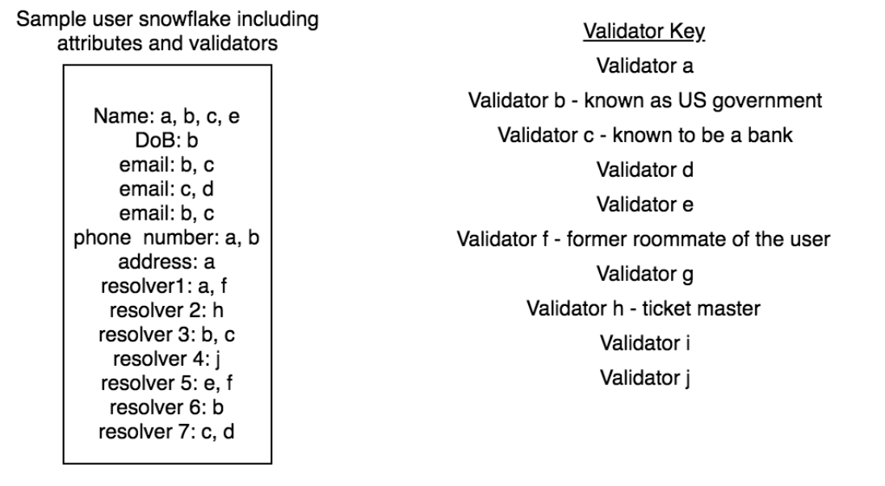
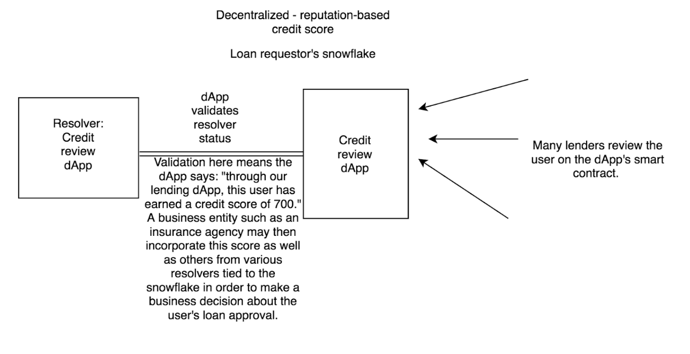

# Hydro Snowflake: Decentralized Identity Management
### June 2018

_______________________________________________________________

## Table of Contents
- [Abstract](#abstract)
- [Background](#background)
  - [The Origins Of Identity](#the-origins-of-identity)
  - [National Identification Numbers](#national-identification-numbers)
  - [Black Market For Identity](#black-market-for-identity)
  - [Identity Theft & E-Commerce](#identity-theft--e-commerce)
  - [Current Forms of Identity](#current-forms-of-identity)
  - [Non-Standardized Documentation](#non-standardized-documentation)
  - [Government Blockchain Initiatives](#government-blockchain-initiatives)
- [Introducing Snowflake](#introducing-snowflake)
  - [A Tokenized Identity](#a-tokenized-identity)
  - [Identity Verification](#identity-verification)
  - [Snowflake Metadata](#snowflake-metadata)
  - [HYDRO Tokens In Snowflake](#hydro-tokens-in-snowflake)
  - [Open Framework](#open-framework)
- [Snowflake: Technical Details](#snowflake-technical-details)
  - [Users](#users)
  - [Validators](#validators)
  - [Resolvers](#resolvers)
  - [Business Entities](#business-entities)
  - [Snowflake Smart Contracts](#snowflake-smart-contracts)
  - [Snowflake API and Hydro Mobile App](#snowflake-api-and-hydro-mobile-app)
  - [Mirroring The ERC-721 Contract Standard](#mirroring-the-erc-721-contract-standard)
- [Implications for Financial Services](#implications-for-financial-services)
  - [Universal Account Onboarding](#universal-account-onboarding)
  - [Validator Rating System](#validator-rating-system)
  - [Machine Learning Validation Standard](#machine-learning-validation-standard)
  - [Document & Contract Verification Standard](#document--contract-verfication-standard)
  - [Payment Verification Standard](#payment-verification-standard)
  - [Anti-Fraud POS dApps](#anti-fraud-pos-dapps)
  - [Global Credit Scoring](#global-credit-scoring)
- [Risks](#risks)
- [Conclusion](#conclusion)
- [Sources](#sources)

_______________________________________________________________

## Abstract

Hydro’s mission is to become the public ledger for financial services, empowering a new decentralized global economy. This ecosystem consists of standard smart contracts that can be used by financial applications, connected through APIs. These standardized smart contracts and API connections reduce the need for firms to hire blockchain developers and allow them to add decentralization to existing systems.

A core component of the financial ecosystem is the notion of identity and identity management. It is vital to creating security for account opening, transactions, payments, and trillions of dollars of global financial activity. With the growth of digital commerce, identity management becomes even more crucial to the future economy.

In this paper, we propose a new paradigm for identity in financial services that leverages a public and decentralized blockchain, called Snowflake. Users own their Snowflake identities, they are immutable, and they can be validated. Each Snowflake identity is tied to cryptography embedded in the user's mobile device, which is connected to a unique ID on the blockchain. This identity can be shared with third-parties at the discretion of the user, and creates the groundwork for Hydro’s future privacy management protocol.

This proposed identity platform can help to solve multiple problems:

1. Paper-based identity management is currently expensive and prone to theft and hacks
2. The dark web has increased the profitability for stolen identities
3. There are no global open standards for identity management, and private blockchain initiatives are making the problem worse
4. E-commerce and digital banking has made it increasingly difficult for companies to confirm their users’ identities
5. Emerging economies fail to utilize the growing use of mobile phones to their advantage in identity creation and management

Hydro’s Snowflake can create a global standard that complies with private and sovereign KYC standards, while empowering billions to own and secure their personal identities. This has implications for instant account onboarding, global ID passports, and when combined with the Hydro Raindrop, near zero credit card and bank fraud.


## Background
### The Origins Of Identity
In our first Whitepaper, we examined the the need for proper authentication of users within a technology ecosystem. Yet, authentication is not sufficient if there has been nothing identifiable to authenticate. In this whitepaper, we examine the urgent need for a better identity management framework that can be applied across financial services. Before exploring how a public blockchain can provide the missing piece to this puzzle by making identity immutable and standardized, let us first examine a more fundamental question: what is identity and where does it come from?

It is believed by scientists that names, the most fundamental forms of identity, pre-date the written word, originating perhaps as soon as humans gained the ability to speak. There is even compelling evidence that other mammals, such as dolphins, establish “identities” using signature whistles as naming conventions for one creature versus another. As with humans, these identities help to forge tight communal relationships among mammals.

The idea of governments formally tracking names, via birth certificates, is a relatively modern one. For years, births and naming were a church function in most western societies. During the immigration wave in the U.S. of the 1800s, which brought 30 million immigrants, reformers pressured the U.S. government to formally track births and deaths in the census, but it wasn’t until World War II that standardized birth certificates establishing where you were born and what was your name became mandatory in the U.S.

Yet, formally establishing these basic pieces of information is not enough to establish a unique identity. From the earliest time, surnames were used to establish what was your occupation, or who your parents were. The surname Smith was applied to blacksmiths, Robertson was the “son of Robert,” and Bin Ali was the “son of Ali.” The commonality of surnames makes identity management incredibly challenging. According to Ancestry.com:

> Most of the approximately 100,000 Japanese surnames in use today only date from 1868, when surnames were mandated for the first time, There are just a few hundred common Chinese surnames, and 20 of them are shared by half the population. There are about 250 Korean surnames, three of them comprising almost half the Korean population, and just about 100 Vietnamese ones, with three making up 60 percent of all names in that country.

In the United States, Smith is the most common surname in 40 of the 50 states. Because of the commonality of names worldwide, proper identity management necessitated governments to start national identification numbers.

### National Identification Numbers
In the U.S. the Social Security number (SSN) was created in 1936 for the sole purpose of tracking the earnings histories of U.S. workers, for use in determining Social Security benefit entitlement (after the adoption of the Social Security Act in August 1935) and computing benefit levels. Names and addresses were considered, along with fingerprints, but names encountered many of the same concerns with commonality raised previously, and in the 1930’s fingerprinting was most associated in the United States with criminal activity.

There are nine digits in the U.S. SSN. The first three digits are assigned by geographic region or zip code, and the middle two numbers are group numbers that further identify the geography, while the last four numbers are random serial numbers. Thus, it is common for businesses to confirm only the last 4-digits of the number for identification purposes, making these numbers extremely prone to theft.

Likewise, many other countries have similar national identification numbers, sometimes called Social Insurance Number, Tax Identification Numbers, or National Identification Numbers.

### Black Market For Identity
Because identities are not immutable, and many governments and private actors in the ecosystem cannot be trusted to create or confirm identity records, there is a thriving black market for fake and forged documents. Take for example, a Cuban birth certificate. To an illegal immigrant in the U.S. having a Cuban birth certificate could mean a path to citizenship in only 1 year, so those forged birth certificates have been sold for $10,000 or more.

It has also been estimated that up to 40% of the passport fraud in the United States involves counterfeit or stolen birth certificates from Puerto Rico, and  Security Alliance reports that in 2008, 45,622 children were born in Puerto Rico, but in that same year 860,000 certified copies of birth certificates were issued! The current government identity system is severely broken, it incentivizes bad actors both in the private and public sector, but also creates a black market that incentivizes impoverished populations to sell their identities for extra income.

With this in mind, how can we expect to have a fair and honest financial ecosystem? Banks, credit card companies, and even startups struggle to properly identify users, and even when they do, is there ever a way to truly know if the person is who they say they are?

### Identity Theft & E-Commerce
As examined in our Raindrop Whitepaper, identity theft is a growing problem in the U.S. and worldwide. In April 2017, Symantec published its Internet Security Threat Report, which estimates 1.1 billion pieces of PII (personally identifiable information) were compromised in various capacities over the course of 2016. Commerce is increasingly done remotely, and this lack of personal contact has made financial fraud easier to perpetrate, and harder for authorities to stop. There is no identification required for the vast majority of online transactions. It is based on a system of “trust” and that there will be a certain percentage of chargebacks and fraud cases that are written off. The average cost of chargebacks alone is approximately 1.47% of a merchant’s yearly revenue, and $118 billion in lost sales occur during false positives - when a merchant stops a legitimate customer from making a purchases because they falsely identified them as a fraudster. These are staggering figures that can easily be solved with immutable IDs tied to the public blockchain that are used during credit card and e-commerce transactions.

### Current Forms of Identity
The overall concept of identity is changing as we approach the Web 3.0 and will continue to evolve over time with the advent of more artificial and sentient intelligence in global society.

Identities currently take two common forms - private and public.
- Private identities are things like telephone numbers, and email addresses.
- Public identities are things like tax identification numbers, passport numbers, and other forms of identification that are formed within civil societies.

Increasingly, research has shown that private forms of identities have begun to tell us more about ourselves, and produce more emotional attachment than public forms. Many have argued that a cell phone number has now replaced a Social Security Number in the United States in importance. According to Statista, global cell phone users are expected to reach 5 Billion in 2019, with over 50% using smartphones.

An example of the longevity and utility of cell phone numbers can be found in the U.S. mobile to mobile porting stats. In 2003, the first year data was collected, only 795,000 numbers were in the U.S. mobile porting database, by 2009 that number ballooned to over 40 Million we would now estimate the number to be in the hundreds of millions but no public data exists. There are now governmental initiatives to make the practice commonplace because lawmakers view phone numbers as “important identifiers” and have said “consumers overwhelmingly prefer to keep their numbers. Psychological studies have shown high levels of distress and anxiety when people are without their cell phones, and they now possess similar attachment qualities as teddy bears for youth.

The idea of what is your identity is changing, with technology more and more intertwined into one’s sense of self. When creating an identity protocol, it is therefore important to not only include public identity, but also private identity in the equation.

### Non-Standardized Documentation
There are increasing problems with document portability across county, state, provincial, or country lines. Not all identity documents are created equal, and the lack of a global standard is one of the chief concerns of those fighting terrorism, money laundering, drug trafficking, and other illegal activities. Take the U.S. as an example, the problem has gotten so bad that the U.S. government has made it mandatory that residents of Kentucky, Maine, Minnesota, Missouri, Montana, Oklahoma, Pennsylvania, South Carolina, and Washington use a U.S. passport for all domestic travel, because these states do not currently issue a state ID that meets the standards of the REAL ID Act of 2005.

This is not just a problem with centralized identification protocols. Because of a desire of entrepreneurs to create proprietary solutions, rather than open architecture ones, many identity protocols that have or will be proposed on top of distributed databases fall victim to the same problems. It is the view of the Hydrogen developers that tokens or platforms must have the flexibility to read, write, extend, connect, and interact with an identity protocol for it to be most effective. In other words, just adding a public blockchain into the equation does not change fundamental flaws in the approach. Putting a proprietary solution at the protocol level for identity management is similar to the 9 U.S. states that do not meet U.S. identity requirements. There are painstaking changes that will need to be made to create compatibility. This is why Hydrogen is fully committed to a simple and standardized protocol.

### Government Blockchain Initiatives
Some of the issues listed above have had the obvious consequences in the public sector, greater interest in blockchain technology. For example, a task force in Illinois presented a plan to create tax records, voting and health histories on a state-run blockchain. The government would become the verifier, rather than the custodian, of people's public service identity, moving from providing data storage to verifying identity. Estonian citizens and e-residents are issued a cryptographically secure digital ID card powered by blockchain infrastructure on the backend, allowing access to various public services, and other countries exploring blockchain ID initiatives include Singapore, Georgia, the UK, and Dubai.

The problem with this is twofold: 1. Governments acting as sole verifiers creates centralization and corruptibility; 2. If every local, state, and national government creates unique private or semi-private blockchains, they will just compound the problems of their non-distributed predecessor databases. For identity management to be truly decentralized and fungible, there must be multiple verifiers and standardized protocols.

Governments may falsely see blockchain “the technology” as a panacea, ignoring the fact that migrating current database infrastructure to a more distributed service is at best only marginally better for the end citizen. At worse, it may make their lives more difficult and complex. Putting false information in an immutable database might be worse than not having any information in there in the first place. Creating systems that are closed architecture and not standardized may compound the current issues seen with global passports and border security.

## Introducing Snowflake
To solve the problems mentioned thus far, the team introduces the Hydro Snowflake - unique identity powered by the public blockchain. Why call it Snowflake? Snowflakes are one of the most beautiful, random, and individualistic phenomenons in nature. Not only do scientists believe they come in 35 different types, there are differences in the atomic structure of the atoms making up the water molecules, making each Snowflake unique.

Snowflake identities must be “minted.” Each minted Snowflake acts as a base identity layer that can be interacted with and extended.

### A Tokenized Identity
Every application, be it web or mobile, consumes some form of identity information.  As a result, users are stuck either repeatedly providing the same data to multiple applications, or relying on central parties to relay said information. If those central parties mishandle user data, users are inevitably vulnerable to identity theft. Further, apps must deal with verifying that the provided user information is valid in order to build meaningful user profiles.

To address these shortcomings, each Snowflake user has a non-fungible token that is mapped to a unique HydroID and associated with the seed created through [Hydro Client-Side Raindrop](https://github.com/hydrogen-dev/hydro-docs/tree/master/Raindrop) on a mobile device.

This non-fungible token supports storage of any arbitrary form of data, stored in external smart contracts called "Resolvers." We call contracts structured to encode data that can be associated with a Snowflake a Resolver as a nod to the analogous concept in services such as DNS and ENS, where external reference points are able to eliminate abstraction by encoding arbitrary data structures that point to, or "resolve to" an atomic entity - in this case, the Snowflake. The architecture of storing information in external contracts that tie back to a singular Snowflake enables unlimited scope for how a user defines their identity, rather than restricting an identity to a pre-defined set of standards. An intuitive comparison would be a device that is able to encode passports, driver's licences, social media accounts, medical records, and other identity-defining data all in a singular source that can be queried in a standard way by any system. In this way, any dApp with which a user interacts can easily become a resolver, maintaining its core functionality while streamlining the mechanisms by which a user can interact with it. 

Because Snowflake only acts as a singular point for a user to manage their data and places no restrictions on the encoding of the data itself, it offers complete flexibility for the implementation of keeping the data public or privatizing it. 

### Multiple Address Ownership
Native to the Snowflake protocol is the capability for users to irrefutably claim multiple Ethereum addresses through cryptographic signatures. In the absence of Snowflake, when users want to interact with dApps on Ethereum, they must either transfer their private key to a wallet on the new device or create a new, entirely unassociated address. Fundamentally, any transfer of a private key away from a local device exposes a user's Ethereum, tokens, and data tied to that address to phishing and malware. Even careful users are likely to fall victim to systems that structurally require the transfer of private keys across devices. Alternatively, creating new, unassociated keypairs doesn't offer much value to users, as all of their data is tied to an address on a separate device. Snowflake allows users to provably tie multiple addresses back to their core Snowflake, extending any Resolver data across their devices without requiring any transfer of private keys. Procedurally, when linking a new address to their Snowflake, the owner address initiates a sealed claim `hash(addressToClaim, secret, hydroID)`. Subsequently, the address to be claimed sends a transaction with the `secret` and `hydroID`. The initial claim is hashed in order to prevent a malicious observer from recognizing which address an owner is trying to claim prior to the completion of the claim. The `secret` parameter is necessary to prevent a [Rainbow Table Attack](https://www.techopedia.com/definition/30617/rainbow-table-attack-cryptography) on the hashed value. 

### Identity Verification
The concept of identity is relatively meaningless without validation. In general, validators are third parties who can vouch for the validity of data tied to an identity. Since Snowflake empowers users to self-associate with on-chain identity information, it seems apparent that Snowflake only enables for self-attested data, which is relatively limited in scope. However, because the nature of a user's self-attested data is arbitrary, Snowflake allows for norms to drive data attestation in fundamentally decentralized fashion. The logic goes as follows: Because entities observing a user's self-attested data will not derive value from this data without third-party attestations, users will find value in connecting with data structures that enable third-party attestation. Users are able to choose which third-party attestations to pursue, which is closely tied to the ability for entities to choose which third-party attestations they accept. In this way, Snowflake enables a free-flowing ecosystem of third-party attestations under any set of standards adopted by corresponding parties, rather than a pre-defined attestation structure native to the identity protocol. 

In practice, validation structures will likely develop whereby off-chain validators can act as parties trusted by individual actors in the decentralized ecosystem. Once the validation happens off-chain, an on-chain merkle hash would be tied to a user’s Snowflake. Because nobody can impersonate a validator without access to their private keys, business entities can incorporate on-chain validations into any relevant business logic by querying a user's Snowflake. If a user changes any of the data, it would lose its prior validations along with any corresponding significance due to the deviance from the on-chain record. Various implementations of similar validation structures can develop, each catered to their particular use-cases (KYC, reputation, identity implementations, etc) while all resolving to a user's Snowflake.

### The Role of Snowflake Metadata Within an Ecosystem of Businesses and dApps
While immutable and standard data native to an identity built on top of the Snowflake protocol help a user establish a secure and global standard for core identity information, Snowflake itself allows users to tie an unlimited range of metadata to their identities by setting third-party dApps as resolvers. As users’ interactions with dApps helps build their on-chain identity, they may set a dApp as a resolver for their Snowflakes, allowing businesses querying the associated metadata to incorporate it into the logic of their own applications.

Fundamentally, a third-party or dApp acts as a certain attribute on a user’s Snowflake. An application prescribes meaning to a user based on associated data with their snowflake. Let us more closely examine these meanings in the context of a few examples.

What does a Resolver mean from the perspective of the user? Resolvers establish a user’s core data. Acquiring validations from reputable sources enhances the integrity of a user’s Resolver data which can be relied on by businesses, governments, or decentralized applications querying any relevant identity information.

What does a Resolver mean from the perspective of an app? Since resolvers encode data about a user, a business can programmatically incorporate this data to drive business logic on its platform to improve user experience on its platform or offer users certain permissions. Requirements for third-party validations of this data could be encoded as part of the business logic. If an app were to recognize Snowflake as an identity protocol, it could prescribe whatever meaning to Resolver data best suits its needs.

- Example 1, KYC validation: a government could (off-chain) allow users to register their Snowflakes for a voting validation. The user could then cast their vote through a third-party voting dApp, which would only tally votes from registered Snowflakes. This process would ensure that each person can only vote once, eliminating voter fraud or Sybil attacks, while providing complete transparency and much greater efficiency to elections. This can apply to any arbitrary set of digital voting structures and does not enforce a specific implementation. 
- Example 2, Social Media: to prevent the creation of fake accounts, an app could implement a system that links a user’s Snowflake to an account on the app. Any accounts that have their name validated by at least X existing users of the app could display a ‘verified’ checkmark on the UI of the app. Unlike the first example, this example factors validations from individuals instead of from large institutions. Also, this example observes validation for the HydroID associated with the Snowflake itself rather than a resolver. The openness of the Snowflake identity framework allows for a wide range of use-cases.

What does being a Resolver mean from the perspective of the Resolver? Resolvers are able to leverage the native functionality of users' Snowflakes. This offers two key points of value:
- Rather than existing as an independent dApp with which the user interacts, they exist as dApps within the ecosystem of Resolvers associated with a given Snowflake. This means a user can seamlessly manage their associated data from a dashboard, and they are not burdened with the struggle of aggregating data from multiple ethereum addresses and various dApps whenever they want to leverage it. 
- Resolvers are able to easily leverage token transfer functionality native to users' Snowflakes. This streamlines the development process for dApps aiming to monetize via functionality such as monthly subscriptions. Users are able to manage Hydro withdrawal balances for all of their resolvers from a single dashboard. 

### HYDRO Tokens In Snowflake

//An application querying these validations may define any nature or level of validation they need for a given Snowflake to be deemed satisfactory; for instance, an application may only grant a user access to certain features if that user's Snowflake has been vouched for by certain whitelisted or known validators.

Through Resolvers, Snowflake acts as a bridge for businesses to use that connects an individual to the individual’s on-chain data. It acts as a single point of contact to streamline business logic. The larger the existing network of dApps that encode user data is, the larger the incentive for a new dApp to join that network. Accordingly, we included a function to charge new dApps a fee in HYDRO who want to join the ecosystem and connect their user data to their users’ Snowflakes. 

The HYDRO token is not only intended to be a gateway into the ecosystem of Resolvers built on top of Snowflake, but also a centerpiece for convenient programmatic token transfers between users and resolvers. Through Snowflake, users can set specific allowances for resolvers to withdraw HYDRO. The user sets the limits on allowed withdrawals on a per-resolver basis, streamlining replication of user-facing models that are currently managed through third-party financial institutions. Snowflake's flexibility with programmatic token transfers allows businesses to encode an arbitrary set of criteria into their business logic for recurrent processes, such as verifying membership within a particular group in order to offer discounted subscriptions for a product.

As we will discuss later on, apps, dApps, products, or platforms built on top of Snowflake can also incorporate HYDRO tokens into their processes. For example, certain kinds of validations or actions may require on-chain HYDRO token transactions, where users would be required to maintain or transfer HYDRO balances, such as an implementation of our [Server-side Raindrop Authentication Protocol](https://github.com/hydrogen-dev/hydro-docs/tree/master/Raindrop).

### Open Framework
It is important to note that the proposed framework is an open protocol for identity management. Unlike other blockchain products, there will be no centralized decision on the strength or authenticity of data associations, attestations validations, or those who provide them. It will be up to the global community to identify and punish bad actors. Later in this paper, we examine potential apps, dApps, and platforms that can be built on top of or integrated into Snowflake to increase the effectiveness of the ecosystem.


## Snowflake: Technical Details

There are four main entities generally important to Snowflake implementations: users, validators, resolvers, and business entities.

### Users
Users mint their Snowflakes to represent their identities. They attach data to their Snowflakes and set resolvers in order to tie any form of metadata to their base Snowflake identities. Users can also maintain balances of HYDRO within Snowflakes, creating an easy and intuitive mechanism by which any dApp can interact with a user’s Snowflake. User data can take any arbitrary format and is associated with Smart Contracts called Resolvers on the Ethereum blockchain. 

### Resolvers
While validators attach validations to a Snowflake, resolvers are set by users themselves. Resolvers are dApps that contain metadata about a user. An intuitive example is CryptoKitties - setting CryptoKitties as a resolver can tie the ownership of certain kitties back to the user's Snowflake identity, even if the Kitties are owned by various Ethereum addresses. If that setting were to be validated by reputable validators through another resolver, it would enable them to prove ownership of a certain address that owns CryptoKitties without needing to expose or transact with that address.

### Validators
While validators are not included in the core Snowflake protocol, they add significant value when introduced at the dApp level. Resolvers built on Snowflake can encode any range of validation criteria. The simplest level would be a validation dApp in which a trusted KYC provider affirms whether a Snowflake is owned by a real person or not. Any Snowflake owner could complete KYC through the trusted party, set the validation dApp as a Resolver for their Snowflake, and prove that they exist to anybody else who also trusts the KYC party without ever meeting them. In practice, dApps can build nonbinary validation structures with a much more far-reaching range of implications in a variety of industries, with meaning derived from off-chain reputation, or their own native on-chain reputation protocols.  

### Business Entities
Business entities are any applications or dApps that build logic into their applications that relies on information tied to a Snowflake. For instance, if a user has tied credit-related information to a Snowflake through one or several third-party dApps, a business entity might use that associated data in order to determine whether the user would be approved for a loan by calling a function on the user's Snowflake. These functions can be called programmatically through APIs, enabling business entities to leverage a user's on-chain associated data without needing to hire blockchain engineers or maintain complicated infrastructure for interacting with Ethereum contracts.  

### Snowflake Smart Contracts
The core snowflake contract stores resolvers, and HYDRO balances corresponding with users' Snowflake Identity Tokens. It allows users to mint tokens, deposit HYDRO, set resolvers, and prove ownership of multiple Ethereum addresses. Users are able to add and remove data associated with their Snowflakes, allowing for flexibility when dealing with legal name changes or other complexities associated with identity management. Users, resolvers, or any interested party are able to deposit HYDRO tokens to the Snowflake smart contract. This facilitates payments, and other token functionality that will be integrated seamlessly into the Hydro ecosystem as it develops.

The Base snowflake identity consists of the summation of:
- Multiple Ethereum addresses claimed by the user
- Resolvers - set by Snowflake owners through their Resolver dashboard

A user’s Snowflake acts as an anchor point for data from all that user’s dApp interactions. A third-party app can see who validated which fields for the user. For example, in the image below, resolver 1 may be a social review dApp to show that the user has been validated as a good roommate. A business entity can see that validator f, a former roommate, validated the owner's info. It can therefore, in its business logic, allow reviewers from resolver 1 to write a review on the UI of its platform because their reviews apply to this snowflake owner.

### Snowflake API and Hydro Mobile App
Hydrogen’s Hydro API will facilitate user and business entity interactions with Snowflake smart contracts. The API provides end users the ability to register their HydroIDs, a prerequisite to minting their Snowflakes, through the Raindrop API integration into the Hydro mobile app. In the next iteration, users will be able to mint their own Snowflake associated with their HydroID through the Hydro mobile app while the Hydro API handles the direct interaction with the blockchain. They will also be able to claim ownership of external addresses through their mobile app. This will streamline their ability to transact with Snowflake dApps without compromizing the security of the wallet stored locally in the memory of the Hydro app on their phones. They will be able to use these owned addresses to attach a broader range of metadata to their snowflake and interact with Resolvers who have implemented Hydro-based payment structures. 

Business entities will be able to use the Hydro API to query the Ethereum blockchain for information contained within the Hydro ecosystem. The API will provide on-chain information to applications in a digestible format that can be easily encoded into their business logic without requiring them to have blockchain developers.

### Mirroring The ERC-721 Contract Standard
ERC-20 tokens, such as HYDRO, share the characteristic of fungibility, meaning each token is seamlessly and equally interchangeable with any other. This makes sense for tokens in the ERC-20 standard since each token has the same functionality as any other token. For an identity protocol, however, non-fungibility drives the meaningfulness behind ownership. If we were able to swap our identities out amongst ourselves with no difference, those identities would carry no value to any observer. Ethereum Request for Comments 721, or ERC-721, is an Ethereum proposal introduced by Dieter Shirley in 2017. Although the HYDRO token itself is built on the ERC-20 standard, our Snowflake protocol’s smart contracts more closely mirror the dynamics found in ERC-721 tokens. These are known as “non-fungible” tokens.

The non-fungibility of each Snowflake is crucial to allowing users to prove ownership of the information associated with their identity. The value of the Snowflake identity is not that it can be exchanged for some monetary value, but because it has unique characteristics that build a user’s on-chain identity. With this in mind, we have moved slightly away from the ERC-721 standard to disallow transfer of ownership of an identity.

A persistent concern in open-source and blockchain communities is the fragmentation of developer effort across multiple projects and standards. We are very aware of this risk, and have designed Snowflake in such a way as to make this eventuality as unlikely as possible. Our break from ERC-721 should not be taken as a criticism of this work, but rather a reflection of the simple reality that identities are anchored to their owners in a way that other unique and collectible tokens are not. Within this constraint, Snowflake was designed to be fundamentally modular and open; it can flexibly incorporate a wide variety of use cases and will serve as a common protocol for making identity-related claims.

## Implications for Financial Services
The open framework of Snowflake will make products, platforms, apps, and dApps built on top of the protocol integral to its long-term success. Below we examine some initial applications that the Hydro community will champion:

### Universal Account Onboarding
Through integration with global KYC providers as validators, Hydro can create a standard one-touch digital account onboarding standard that can adapt to the wide range of KYC standards existent in today’s world.

### Validator Rating System
This simple dApp would create an upvoting/downvoting system for validators across multiple identity areas. A reputation-based scoring system would create incentive-driven honesty in votes. This decentralized reputation-building can prescribe greater meaning to some validators than a binary process.

### Machine Learning Validation Standard
The Hydrogen platform contains the Ion AutoML API. With sufficient validations globally, a product can be created using the AutoML API that rates, sorts, ranks, flags, and removes validations and validators in a decentralized and data driven way. Smart contracts can be integrated on top of the AutoML capabilities for transparency.

### Document & Contract Verification Standard
The next phase of Project Hydro is called Ice. This is a document management protocol. The Snowflake, combined with Raindrop, will be integral for the scaling of Ice. A large problem with e-signing technologies is there is never any authentication or verification done, other than single factor usernames and passwords. Validated snowflakes and multi-factor authentications for any document signings or contract sealing can be built into the Hydro mobile app. Some simple dApps built on top of the Ice protocol can also integrate popular e-signing softwares such as DocuSign and Adobe Sign.

### Payment Verification Standard
An upcoming phase of Project Hydro is called Tide. This is a payment and data privacy protocol. There is great opportunity to create a dApp that can reference validations and create “Levels” or strength of the validation. An implication of this might be a plug-in for financial services websites that checks the level of validation. A highest level validation may require no extra verification or authentication, while the lowest validation may require a secondary form of ID.

### Anti-Fraud POS dApps
Most point of sales systems require simple swiping or chip verifications on debit and credit cards. There are no additional identity checks done during the sale, only post-sale, as examined in this paper. As firms like Square, Paypal, Braintree, and Stripe increase their presences globally, billions will have access to instant point of sale transaction protocols. There are very interesting dApps that can be built that integrate the Snowflake, Raindrop, Tide, and Mist phases of Hydro to produce a decentralized POS network.

### Global Credit Scoring
Access to credit is a huge global problem, and one of the major issues affecting the 2 Billion unbanked. To counter this problem, there has been a FICO scoring system setup in the U.S. to attempt to use financial data to validate credit worthiness. But this system is fundamentally flawed in that it takes in no “social proof” and only accounts for those already in the financial system with bank accounts and credit cards. The Hydro API can provide business entities with the information they need to build more robust credit scoring models without relying on central parties to store sensitive user data.

A third-party business entity can rely on information tied to a user’s snowflake through a resolver for that user’s credit scoring data in order to drive its business decision in delivering a loan.


## Risks
The Snowflake ecosystem is dependent on off-chain validators as best actors, and a global decentralized community that would punish bad behavior. For example, we do not want to encourage the same “black markets” for verification and documentation that exist off-chain and bring them on-chain, so it is imperative that the ecosystem function as designed. This is why the HYDRO token and staking are so vital to keeping the ecosystem honest.

There is additional risk of “fragmentation” within the ecosystem. It will be up to a business or website to decide how much validation or attestation is acceptable to approve a user. Because Snowflake is a protocol, and not a product, it will be imperative that best use cases are standardized quickly to prevent this fragmentation of acceptance. For example, a validated state driver’s license may be accepted on Amazon for checkout, but on Google there might be an additional social attestation required. It is the Hydro team’s goal to provide best practices, sample apps, and widgets for sites to use for various use cases to combat this issue.

There is an “educational” risk to the ecosystem as well. Many incumbent blockchain identity ecosystems are built in a closed architecture or private way. There has been a huge disinformation campaign from private blockchain providers on the perceived weaknesses in public blockchain. The Snowflake ecosystem is dependent on users trusting the encryption on the public blockchain and their smartphone.

## Conclusion
Identity management globally is broken and it is only getting worse as we approach the dawn of the Web 3.0. Identity remains centralized, prone to corruption and theft, and billions are still shut out from financial services solutions in part because of it.

The Hydro Snowflake framework is being implemented to solve key parts of the identity management problem:

- Creation of a standard decentralized framework to store personal information that can be encrypted on-chain
- Creation of an off-chain validation and attestation network that links to on-chain data
- Creation of standardized apps, QR codes, UI widgets, and other products on top of the Snowflake protocol that can be easily integrated

The Hydro team believes the framework set forth can be the standard identity management protocol of the Web 3.0. Due to the ease of use of the Hydro API both apps and dApps can quickly implement the Snowflake architecture into their own.

_______________________________________________________________

## Sources

[PNAS](http://www.pnas.org/content/110/32/13216)

[Social Security Administration](https://www.ssa.gov/policy/docs/ssb/v69n2/v69n2p55.html)

[History Channel](https://www.history.com/news/the-history-of-birth-certificates-is-shorter-than-you-might-think)

[Ancestry](https://blogs.ancestry.com/cm/what-can-your-surname-tell-you/)

[CNN](https://www.cnn.com/2013/01/18/justice/florida-cuban-birth-certificates/index.html)

[Watchdog](https://www.watchdog.org/florida/those-with-fake-birth-certificates-find-it-s-easy-to/article_a3935cbf-74b8-5237-9b0a-ae17748f6786.html)

[Martin Private Investigators](http://www.martinpi.com/your-cell-phone-number-is-your-new-social-security-number/)

[Statista](https://www.statista.com/statistics/274774/forecast-of-mobile-phone-users-worldwide/)

[Statista (2)](https://www.statista.com/statistics/188511/mobile-to-mobile-telephone-numbers-in-us-porting-database-since-2003/)

[Federal Register](https://www.federalregister.gov/documents/2017/11/27/2017-25458/nationwide-number-portability-numbering-policies-for-modern-communications)

[Psychology Today](https://www.psychologytoday.com/us/blog/fulfillment-any-age/201609/is-why-we-cant-put-down-our-phones)

[Symantec](https://www.symantec.com/content/dam/symantec/docs/reports/istr-22-2017-en.pdf)

[Chargebacks911](https://chargebacks911.com/chargeback-stats-2017/)

[Travel & Leisure](http://www.travelandleisure.com/airlines-airports/no-drivers-license-tsa-rule)

[Coindesk](https://www.coindesk.com/illinois-eyes-blockchain-for-ids-and-public-asset-management)

[Enterprise Innovation](https://www.enterpriseinnovation.net/article/how-are-governments-using-blockchain-technology-1122807855)

[W3](https://www.w3.org/DesignIssues/Metadata.html)

[PSU Meteorology](http://news.psu.edu/story/141325/2009/02/18/research/probing-question-each-snowflake-really-unique)

[Wikipedia Cryptography](https://en.wikipedia.org/wiki/Salt_(cryptography))
